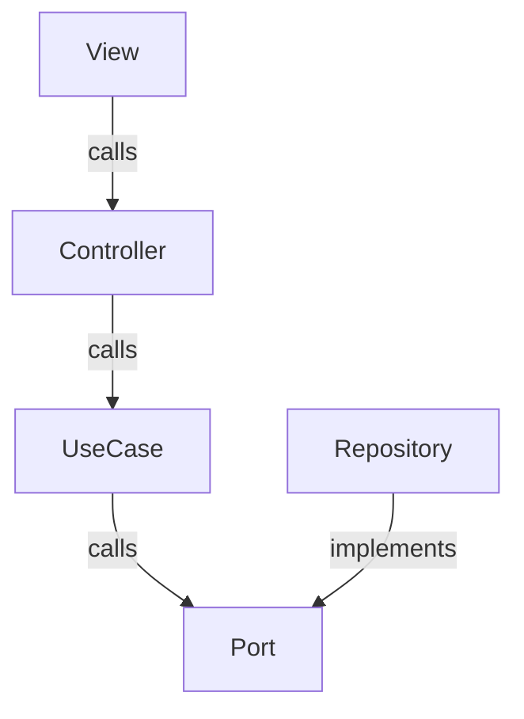

Nome: Diego Rodrigues
e-mail: diegorodrigues290@hotmail.com

## English

# Introduction

This project is a technical challenge for a Frontend Developer position at Qikserve.
This application is designed to display some details of a restaurant and its menu. Users can search for items, view details by clicking on them, and add them to the shopping cart with the chosen quantity. In the cart, it is possible to view items, change quantities, remove them by reducing the quantity to zero, and see the total cart value.

## Technologies used

The project was built using the following technologies:

- Vite
- React
- Typescript
- Emotion
- Redux Toolkit
- Axios
- Jest
- Cypress

The choice of these technologies was based on their modernity and effectiveness for frontend projects. I opted for Vite due to its speed and ease of configuration, providing a more agile development environment. React and Typescript were chosen for their robustness and security in web application development, while Redux Toolkit facilitates efficient state management. Emotion was chosen to allow more flexible and powerful styling. Axios is known for its simplicity and ability to handle HTTP requests. Finally, Jest and Cypress are widely recognized and trusted tools for unit and end-to-end testing, ensuring a more reliable and bug-free application

## Architecture used

- Aiming for the decoupling of business logic from the frontend, i used the hexagonal architecture, which is as follows:



In each project, the choice of architecture is crucial and should be tailored to its specific needs. In this case, I chose the hexagonal architecture, recognizing that, although it adds complexity, it brings significant benefits to the challenge. The main merit of hexagonal architecture lies in its efficient decoupling of the frontend. This means that the library or framework in use is not directly linked to the application's business logic, allowing for replacements or changes without impacting the core business rules. This approach ensures greater flexibility and sustainability of the code over time.

## To run project

- Recommended Node version: 20.11.0

- Clone the project, access local directory and install the project dependencies.
```bash
  git clone https://github.com/diego290/qikserve-challenge.git

  cd qikserve-challenge

  npm install
```

- I created a mock with stubby due to the too many requests issue with the provided API.
- With locally mock.
```bash
  npm run start:stubby
```

- Use the provided API for the development of this application.
- Development environments.
```bash
  npm run start:dev
```

## To build the project

- Development environments.
```bash
  npm run build:dev
```

- Production environments.
```bash
  npm run build:prd
```

## To run unit tests

- This command runs all the unit tests.
```bash
  npm run test
```

- This command continuously runs all the unit tests while developing.
```bash
  npm run test:watch
```

- This command run all react tests and generate coverage reports files in directory `coverage`.
```bash
  npm run test:coverage
```

## To run end-to-end tests

- This command opens the Cypress dashboard so that you can execute the tests manually.
```bash
  npm run cy:e2e
```

- This command runs the e2e tests in the terminal, providing reports of the executed tests.
```bash
  npm run cy:test-e2e
```

## Português

# Introdução

Este projeto é um desafio técnico para uma posição de Desenvolvedor Frontend na Qikserve.
Esta aplicação foi projetada para exibir alguns detalhes de um restaurante e seu cardápio. Os usuários podem pesquisar por itens, visualizar detalhes clicando neles e adicioná-los ao carrinho de compras com a quantidade escolhida. No carrinho, é possível visualizar os itens, alterar quantidades, removê-los reduzindo a quantidade a zero e ver o valor total do carrinho.

## Tecnologias utilizadas

O projeto foi construído usando as seguintes tecnologias:

- Vite
- React
- Typescript
- Emotion
- Redux Toolkit
- Axios
- Jest
- Cypress

A escolha dessas tecnologias foi baseada em sua modernidade e eficácia para projetos de frontend. Optei pelo Vite devido à sua velocidade e facilidade de configuração, proporcionando um ambiente de desenvolvimento mais ágil. React e Typescript foram escolhidos pela robustez e segurança no desenvolvimento de aplicações web, enquanto o Redux Toolkit facilita o gerenciamento de estado de forma eficiente. Emotion foi escolhido para permitir uma estilização mais flexível e poderosa. Axios é conhecido por sua simplicidade e capacidade de lidar com solicitações HTTP. Por fim, Jest e Cypress são ferramentas amplamente reconhecidas e confiáveis para testes unitários e end-to-end, garantindo uma aplicação mais confiável e livre de bugs.

## Arquitetura utilizada

- Com o objetivo de desacoplar a lógica de negócios do frontend, usei a arquitetura hexagonal, que é a seguinte:


Em cada projeto, a escolha da arquitetura é crucial e deve ser adaptada às suas necessidades específicas. Neste caso, escolhi a arquitetura hexagonal, reconhecendo que, embora adicione complexidade, traz benefícios significativos para o desafio. O principal mérito da arquitetura hexagonal reside em seu desacoplamento eficiente do frontend. Isso significa que a biblioteca ou framework em uso não está diretamente ligado à lógica de negócios da aplicação, permitindo substituições ou alterações sem impactar as regras de negócio centrais. Esta abordagem garante maior flexibilidade e sustentabilidade do código ao longo do tempo.

## Para executar o projeto

- Versão do Node recomendada: 20.11.0.

- Clone o projeto, acesse o diretório local e instale as dependências do projeto.
```bash
  git clone https://github.com/diego290/qikserve-challenge.git

  cd qikserve-challenge

  npm install
```

- Criei um mock com stubby devido ao problema de muitas solicitações com a API fornecida.
- Com mock local.
```bash
  npm run start:stubby
```

- Use a API fornecida para o desenvolvimento desta aplicação.
- Ambientes de desenvolvimento.
```bash
  npm run start:dev
```

## Para buildar o projeto

- Ambientes de desenvolvimento.
```bash
  npm run build:dev
```

- Ambientes de produção.
```bash
  npm run build:prd
```

## Para executar testes unitários

- Este comando executa todos os testes unitários.
```bash
  npm run test
```

- Este comando executa continuamente todos os testes unitários durante o desenvolvimento.
```bash
  npm run test:watch
```

- Este comando executa todos os testes do React e gera arquivos de relatórios de cobertura no diretório `coverage`.
```bash
  npm run test:coverage
```

## Para executar testes end-to-end

- Este comando abre o painel do Cypress para que você possa executar os testes manualmente.
```bash
  npm run cy:e2e
```

- Este comando executa os testes e2e no terminal, fornecendo relatórios dos testes executados.
```bash
  npm run cy:test-e2e
```
